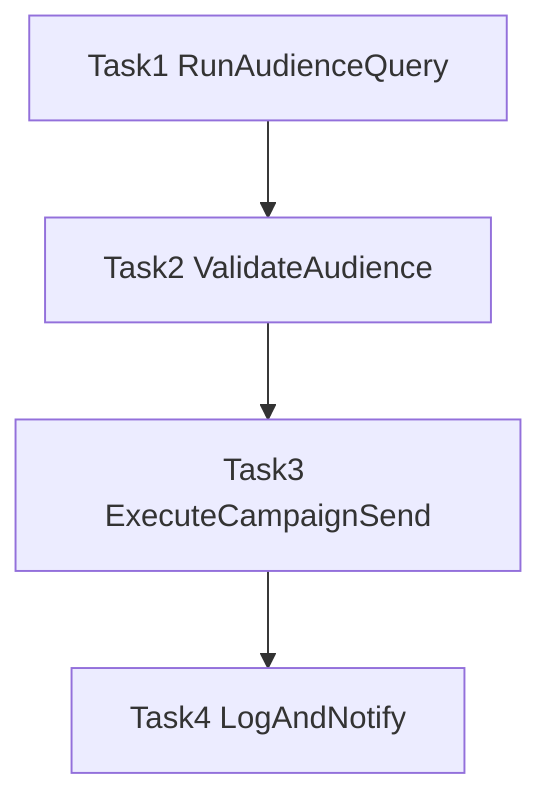

# Build Airflow DAG in part_3

## Scope
Implement the DAG skeleton described in [ai-session/part-3_spec.md](/Users/dorian599/Work/ME/lifecycle-platform-challenge/ai-session/part-3_spec.md), wiring Part 1 and Part 2 artifacts into a linear 4-task pipeline.

## Implementation target
- Create DAG module at [part_3/campaign_pipeline_dag.py](/Users/dorian599/Work/ME/lifecycle-platform-challenge/part_3/campaign_pipeline_dag.py).

## Planned design
- Use Airflow TaskFlow API (`@dag`, `@task`) for clear XCom dict passing.
- Configure DAG with:
  - `schedule="0 5 * * *"`
  - `catchup=False`
  - default task args: `retries=2`, `retry_delay=timedelta(minutes=5)`, `sla=timedelta(hours=3)`
  - explicit UTC-aware `start_date`
- Keep strict linear dependency chain:
  - `task_1_run_audience_query` -> `task_2_validate_audience` -> `task_3_execute_campaign_send` -> `task_4_log_and_notify`

## Task-by-task implementation plan
- **Task 1 (`task_1_run_audience_query`)**
  - Read SQL from [part_1/sms_reactivation_audience.sql](/Users/dorian599/Work/ME/lifecycle-platform-challenge/part_1/sms_reactivation_audience.sql).
  - Run/create staging table via BigQuery hook/operator pattern in-task (skeleton-ready placeholders for project/dataset).
  - Return dict with staging table reference and audience count placeholder/actual count.
- **Task 2 (`task_2_validate_audience`)**
  - Consume Task 1 output.
  - Enforce validation gates: count `> 0` and `<= 2 * historical_avg`.
  - Handle cold start (missing baseline) with warning + documented default behavior.
  - Raise `AirflowException` when checks fail.
  - Return validation dict (`audience_count`, `historical_avg`, `count_to_avg_ratio`, `passed`).
- **Task 3 (`task_3_execute_campaign_send`)**
  - Consume Task 1 + Task 2 outputs.
  - Load audience rows from staging table into `list[dict]`.
  - Import/call `execute_campaign_send` from [part_2/campaign_send_pipeline.py](/Users/dorian599/Work/ME/lifecycle-platform-challenge/part_2/campaign_send_pipeline.py).
  - Use placeholder ESP client class and configurable `campaign_id`/`sent_log_path`.
  - Return send summary dict.
- **Task 4 (`task_4_log_and_notify`)**
  - Consume outputs from prior tasks.
  - Insert reporting record to BigQuery reporting table (skeleton SQL/hook call).
  - Send Slack summary via webhook/operator placeholder with structured message.
  - Return final run summary dict.

## Validation and quality checks
- Ensure task names and dependency order exactly match spec.
- Ensure retry, retry_delay, SLA, and schedule are configured in DAG code.
- Ensure Task 2 blocks Task 3 on validation failure.
- Ensure Task 3 integrates Part 2 function contract.
- Ensure Task 4 includes both reporting insert and Slack notification flow.
- Keep TODO markers only for infrastructure-specific values (project, datasets, webhook secret, ESP concrete client).

## Architecture flow

