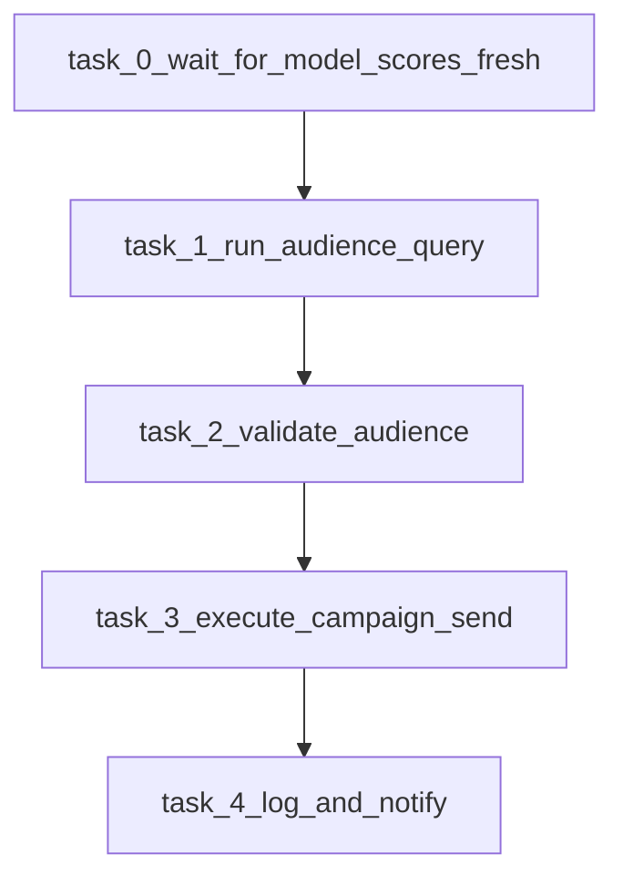

# Part 4 design deliverables in `part_4/`

## Goal
Create a small, readable documentation bundle under [part_4](/Users/dorian599/Work/ME/lifecycle-platform-challenge/part_4) that an implementer (or AI agent) can follow to apply the value-model integration described in [ai-session/part-4_spec.md](/Users/dorian599/Work/ME/lifecycle-platform-challenge/ai-session/part-4_spec.md).

## What exists today (baseline)
- Audience SQL: [part_1/sms_reactivation_audience.sql](/Users/dorian599/Work/ME/lifecycle-platform-challenge/part_1/sms_reactivation_audience.sql)
- Send pipeline: [part_2/campaign_send_pipeline.py](/Users/dorian599/Work/ME/lifecycle-platform-challenge/part_2/campaign_send_pipeline.py)
- DAG skeleton: [part_3/campaign_pipeline_dag.py](/Users/dorian599/Work/ME/lifecycle-platform-challenge/part_3/campaign_pipeline_dag.py)
- `part_4/` folder: **not present** (will be created)

## Deliverables to add (recommended file split)
Create [part_4/README.md](/Users/dorian599/Work/ME/lifecycle-platform-challenge/part_4/README.md) as the index, linking the following:

1. [part_4/01_bigquery_integration.md](/Users/dorian599/Work/ME/lifecycle-platform-challenge/part_4/01_bigquery_integration.md)
   - Restate the new tables (`renter_send_scores`, `model_send_config`) and the **JOIN + threshold + freshness** contract.
   - Provide **pseudocode SQL** showing how to extend the existing Part 1 CTE chain:
     - expand `params` to include `segment_id` (and optional overrides)
     - add `config` resolution CTE (table-backed, with a short-term CTE fallback option)
     - add `latest_scores` CTE with `DATE(scored_at)=as_of_date`, `QUALIFY` dedupe, inner join to audience
     - list augmented output columns for observability
   - Call out **idempotency**: all time/model selection anchored to `as_of_date`.

2. [part_4/02_airflow_dag_changes.md](/Users/dorian599/Work/ME/lifecycle-platform-challenge/part_4/02_airflow_dag_changes.md)
   - Describe the new linear dependency: `task_0_wait_for_model_scores_fresh` → existing Task 1–4 chain in [part_3/campaign_pipeline_dag.py](/Users/dorian599/Work/ME/lifecycle-platform-challenge/part_3/campaign_pipeline_dag.py).
   - Provide **pseudocode** for freshness checks (BigQuery SQL used by a sensor) and recommended Airflow primitives:
     - `SqlSensor` / TaskFlow sensor with `poke_interval`, `timeout`, `mode="reschedule"`.
   - Specify **XCom contract extensions** Task 1 should emit (e.g., `score_date_used`, `model_version_used`, `threshold_used`, `is_fallback_mode`).

3. [part_4/03_model_delay_policy.md](/Users/dorian599/Work/ME/lifecycle-platform-challenge/part_4/03_model_delay_policy.md)
   - Document the business tradeoff and the three operational modes from the spec:
     - `BLOCK_AND_WAIT` (default)
     - `SKIP_CAMPAIGN_IF_STALE`
     - `FALLBACK_WITH_STRICT_GUARDRAILS`
   - Provide a decision table: what happens at sensor timeout, what gets logged/reported/Slack-notified, and how Task 2/4 should record `pipeline_status`.

## Optional (only if it improves clarity without bloating)
- Add [part_4/snippets/freshness_check.sql](/Users/dorian599/Work/ME/lifecycle-platform-challenge/part_4/snippets/freshness_check.sql) as a copy-pastable sensor query template.

## Out of scope for this plan (unless you ask)
- Actually modifying [part_1/sms_reactivation_audience.sql](/Users/dorian599/Work/ME/lifecycle-platform-challenge/part_1/sms_reactivation_audience.sql) or [part_3/campaign_pipeline_dag.py](/Users/dorian599/Work/ME/lifecycle-platform-challenge/part_3/campaign_pipeline_dag.py) — this plan only creates the `part_4` design artifacts.

## Acceptance criteria
- `part_4/` contains the docs above and clearly maps each spec section to concrete integration steps.
- BigQuery section includes a coherent **JOIN pattern**, **threshold parameterization**, and **multi-segment model config** story.
- Airflow section includes **freshness dependency** and **sensor parameters** with sensible defaults.
- Delay section explains **wait vs skip vs fallback** and what to emit to reporting/Slack.

